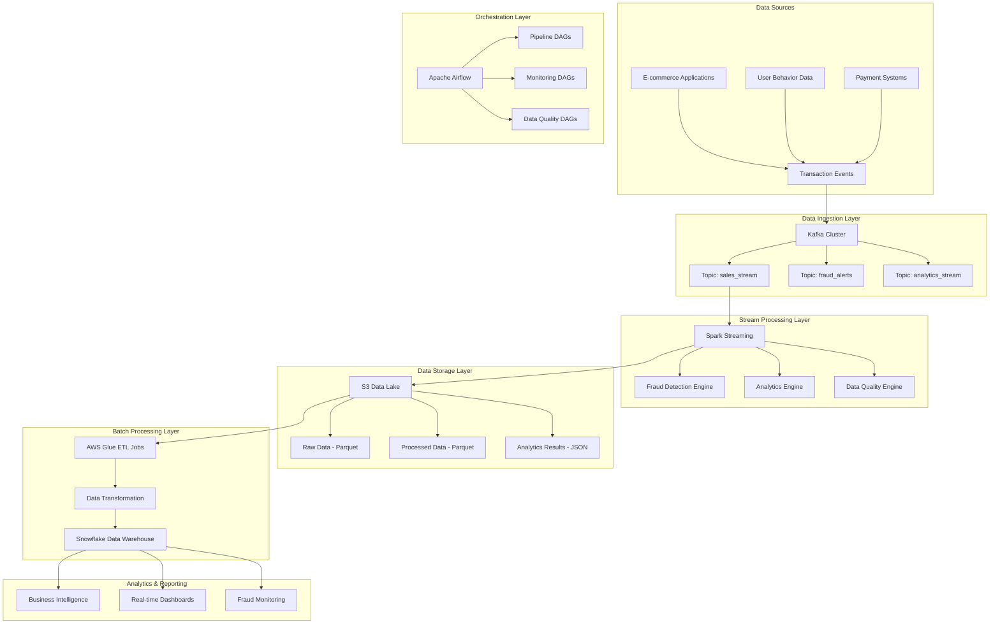

# Streamify Analytics Pipeline - Architecture Documentation

## System Architecture Overview

The Streamify Analytics Pipeline is a comprehensive real-time data processing system designed for e-commerce transaction analytics and fraud detection. The architecture follows modern data engineering best practices with a focus on scalability, reliability, and real-time processing capabilities.

## High-Level Architecture



## Component Architecture

### 1. Data Ingestion Layer

#### Apache Kafka Cluster
- **Purpose**: High-throughput, distributed streaming platform
- **Components**:
  - Zookeeper: Cluster coordination and metadata management
  - Kafka Brokers: Message storage and replication
  - Topics: Logical channels for data streams

#### Topic Design
```
sales_stream (3 partitions, replication factor: 1)
├── Raw transaction events
├── Schema: Transaction schema with 18 fields
└── Retention: 7 days

fraud_alerts (2 partitions, replication factor: 1)
├── Fraud detection results
├── Schema: Alert schema with fraud scoring
└── Retention: 30 days

analytics_stream (2 partitions, replication factor: 1)
├── Real-time analytics results
├── Schema: Windowed aggregations
└── Retention: 7 days
```

### 2. Stream Processing Layer

#### Apache Spark Streaming
- **Framework**: PySpark with Structured Streaming
- **Processing Mode**: Micro-batch processing (1-minute windows)
- **Checkpointing**: Fault tolerance and recovery

#### Fraud Detection Engine
```python
class FraudDetector:
    - Amount-based detection (thresholds)
    - Velocity-based detection (rapid transactions)
    - Geographic anomaly detection
    - Device pattern analysis
    - Machine learning scoring
```

#### Analytics Engine
```python
class RealTimeAnalyticsEngine:
    - Windowed aggregations (1-minute sliding windows)
    - KPI calculations (revenue, conversion rates)
    - Product performance analysis
    - User behavior analytics
    - Geographic distribution analysis
```

### 3. Data Storage Layer

#### S3 Data Lake Architecture
```
s3://streamify-analytics-data-lake/
├── raw_transactions/
│   ├── year=2024/month=01/day=15/hour=10/
│   └── format: Parquet, partitioned by time
├── processed_transactions/
│   ├── year=2024/month=01/day=15/
│   └── format: Parquet, cleaned data
├── fraud_alerts/
│   ├── year=2024/month=01/day=15/
│   └── format: JSON, fraud detection results
└── analytics_results/
    ├── year=2024/month=01/day=15/
    └── format: JSON, aggregated metrics
```

#### Snowflake Data Warehouse
- **Database**: STREAMIFY_ANALYTICS
- **Schema**: PUBLIC
- **Tables**:
  - `raw_transactions`: Complete transaction history
  - `fraud_alerts`: Fraud detection results
  - `analytics_results`: Windowed aggregations
  - `kpi_metrics`: Business intelligence metrics

### 4. Batch Processing Layer

#### AWS Glue ETL Jobs
- **Job Type**: Spark-based ETL processing
- **Schedule**: Hourly execution via Airflow
- **Functions**:
  - Data transformation and cleaning
  - Schema enforcement
  - Data quality validation
  - Aggregation calculations

#### Data Flow
```
S3 Raw Data → Glue ETL → Data Transformation → Snowflake Warehouse
```

### 5. Orchestration Layer

#### Apache Airflow
- **Scheduler**: Cron-based scheduling
- **DAGs**:
  - `streamify_analytics_pipeline`: Main hourly pipeline
  - `fraud_detection_monitoring`: 15-minute fraud monitoring
- **Features**:
  - Workflow orchestration
  - Error handling and retries
  - Monitoring and alerting
  - Data quality checks

## Data Flow Architecture

### Real-time Processing Flow
```
1. Data Generation → Kafka Producer → sales_stream topic
2. Spark Streaming consumes from sales_stream
3. Parallel processing:
   ├── Fraud Detection → fraud_alerts topic
   ├── Analytics Engine → analytics_stream topic
   └── Raw Data → S3 Data Lake (Parquet)
4. Real-time consumers process alerts and analytics
```

### Batch Processing Flow
```
1. Airflow triggers hourly ETL job
2. AWS Glue reads from S3 Data Lake
3. Data transformation and cleaning
4. Load to Snowflake Data Warehouse
5. Generate analytics reports
6. Data quality validation
```

## Security Architecture

### Data Security
- **Encryption in Transit**: TLS/SSL for all communications
- **Encryption at Rest**: S3 server-side encryption, Snowflake encryption
- **Access Control**: IAM roles and policies
- **Network Security**: VPC configuration

### Authentication & Authorization
```
AWS IAM Roles:
├── GlueServiceRole-StreamifyAnalytics
├── S3FullAccess
└── CloudWatchLogsFullAccess

Snowflake Access:
├── Service Account with limited permissions
├── Warehouse: COMPUTE_WH
└── Database: STREAMIFY_ANALYTICS
```

## Monitoring Architecture

### Health Monitoring
- **Kafka**: Cluster health, topic lag, throughput
- **Spark**: Job status, resource utilization
- **S3**: Storage usage, access patterns
- **Snowflake**: Query performance, data freshness
- **System**: CPU, memory, disk usage

### Alerting System
```
Alert Levels:
├── CRITICAL: System failures, data loss
├── WARNING: Performance degradation
└── INFO: Normal operations

Notification Channels:
├── Email alerts
├── Slack notifications
└── PagerDuty integration
```

## Scalability Architecture

### Horizontal Scaling
- **Kafka**: Add more brokers and partitions
- **Spark**: Scale executors based on workload
- **S3**: Automatic scaling with partitioning
- **Snowflake**: Multi-cluster warehouses

### Performance Optimization
- **Kafka**: Tune batch size, compression, retention
- **Spark**: Optimize windowing, checkpointing
- **S3**: Use Parquet format, partitioning
- **Snowflake**: Query optimization, clustering

## Disaster Recovery

### Backup Strategy
- **Kafka**: Topic replication across brokers
- **S3**: Cross-region replication
- **Snowflake**: Automatic backups and point-in-time recovery
- **Code**: Git repository with CI/CD

### Recovery Procedures
1. **Kafka Failure**: Restart services, restore from replicas
2. **Spark Failure**: Restart from checkpoints
3. **S3 Failure**: Failover to secondary region
4. **Snowflake Failure**: Restore from backups

## Technology Stack Details

### Core Technologies
| Component | Technology | Version | Purpose |
|-----------|------------|---------|---------|
| **Streaming** | Apache Kafka | 2.8+ | Message streaming |
| **Processing** | Apache Spark | 3.4+ | Stream processing |
| **Orchestration** | Apache Airflow | 2.7+ | Workflow management |
| **Storage** | AWS S3 | Latest | Data lake |
| **Warehouse** | Snowflake | Latest | Data warehouse |
| **ETL** | AWS Glue | Latest | Data transformation |
| **Language** | Python | 3.8+ | Development |

### Dependencies
```python
# Core dependencies
kafka-python==2.0.2
pyspark==3.4.1
faker==19.6.2
boto3==1.28.57
snowflake-connector-python==3.0.3
apache-airflow==2.7.1

# Data processing
pandas==2.0.3
numpy==1.24.3
pyarrow==12.0.1
```

## Deployment Architecture

### Development Environment
- **Local Development**: Docker Compose
- **Testing**: Unit tests, integration tests
- **CI/CD**: GitHub Actions

### Production Environment
- **Infrastructure**: AWS EC2 instances
- **Containerization**: Docker containers
- **Orchestration**: Docker Compose
- **Monitoring**: CloudWatch, custom monitoring

### Environment Configuration
```yaml
# Development
KAFKA_BOOTSTRAP_SERVERS: localhost:9092
S3_BUCKET_NAME: dev-streamify-analytics
SNOWFLAKE_WAREHOUSE: DEV_WH

# Production
KAFKA_BOOTSTRAP_SERVERS: kafka-cluster:9092
S3_BUCKET_NAME: prod-streamify-analytics
SNOWFLAKE_WAREHOUSE: PROD_WH
```

## Performance Characteristics

### Throughput Metrics
- **Data Generation**: 1000+ transactions/minute
- **Kafka Throughput**: 10,000+ messages/second
- **Spark Processing**: 5,000+ events/second
- **S3 Storage**: 100+ GB/day
- **Snowflake Loading**: 1M+ records/hour

### Latency Metrics
- **End-to-End Processing**: < 30 seconds
- **Fraud Detection**: < 5 seconds
- **Analytics Generation**: < 10 seconds
- **Data Warehouse Loading**: < 5 minutes

### Resource Requirements
- **Kafka**: 2 CPU cores, 4GB RAM
- **Spark**: 4 CPU cores, 8GB RAM
- **Airflow**: 2 CPU cores, 4GB RAM
- **Storage**: 1TB+ S3 storage
- **Snowflake**: 2 credits/hour

## Future Enhancements

### Planned Improvements
1. **Machine Learning**: Advanced fraud detection models
2. **Real-time Dashboards**: Grafana integration
3. **API Layer**: REST APIs for data access
4. **Multi-region**: Global deployment
5. **Advanced Analytics**: Predictive analytics

### Scalability Roadmap
1. **Phase 1**: Current architecture (1M transactions/day)
2. **Phase 2**: Enhanced processing (10M transactions/day)
3. **Phase 3**: Global scale (100M transactions/day)

---

This architecture provides a robust, scalable foundation for real-time e-commerce analytics and fraud detection, with clear separation of concerns and modern data engineering best practices.
