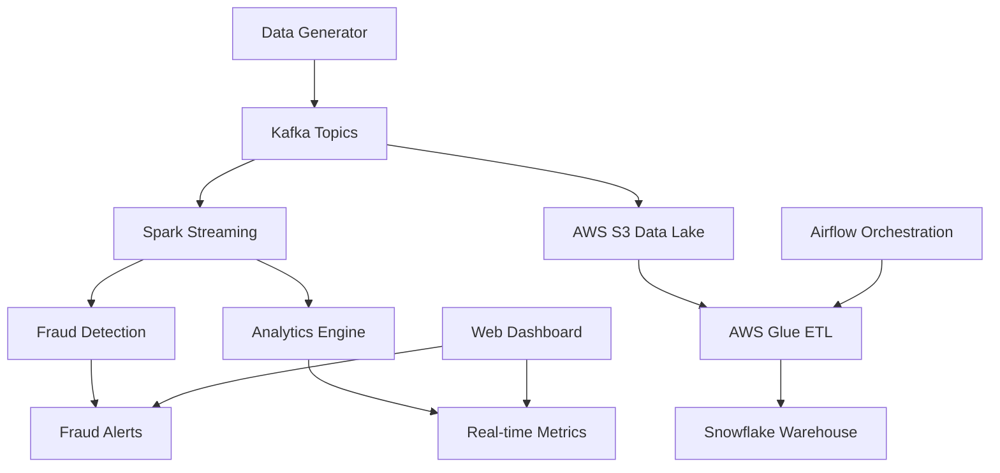

# 🚀 Streamify Analytics Pipeline

A real-time merchant analytics and fraud detection pipeline built with modern data engineering technologies. Features live data processing, advanced ML-based fraud detection, and interactive web dashboard.

## 📊 Architecture



## 🛠️ Tech Stack

- **Streaming**: Apache Kafka, Spark Streaming
- **Cloud**: AWS (S3, Glue, EC2), Snowflake
- **Orchestration**: Apache Airflow
- **Web**: Flask, HTML/CSS/JavaScript
- **Language**: Python 3.x

## 🚀 Quick Start

### Prerequisites
- Python 3.8+
- Docker & Docker Compose (optional)
- Flask

### 1. Setup
```bash
git clone https://github.com/your-username/streamify-analytics-pipeline.git
cd streamify-analytics-pipeline
pip install -r requirements.txt
```

### 2. Web Dashboard (Recommended)
```bash
python app.py
# Open http://localhost:8080
```

**Features:**
- 🎮 Interactive controls (Start/Stop/Reset)
- 📊 Real-time metrics and charts
- 🚨 Live fraud detection with ML scoring
- 💳 Transaction feed with risk factors

### 3. Full Stack with Docker
```bash
# Start Kafka services
docker-compose up -d zookeeper kafka

# Create topics
docker-compose exec kafka kafka-topics --bootstrap-server localhost:9092 --create --topic sales_stream --partitions 3 --replication-factor 1
docker-compose exec kafka kafka-topics --bootstrap-server localhost:9092 --create --topic fraud_alerts --partitions 3 --replication-factor 1
docker-compose exec kafka kafka-topics --bootstrap-server localhost:9092 --create --topic analytics_stream --partitions 3 --replication-factor 1

# Start dashboard
python app.py
```

## 🖥️ Live Dashboard


**Real-time Features:**
- Live fraud detection with 5 risk factors
- ML-based scoring (Amount, Velocity, Geographic, Device, Pattern)
- Color-coded alerts (Critical/High/Medium/Low)
- Interactive charts and analytics
- Transaction feed with detailed risk breakdown

## 🔍 Data Sources

### Real Services
- ✅ **Apache Kafka**: Real message streaming
- ✅ **Faker Library**: Realistic transaction generation
- ✅ **Flask Web Framework**: Production-ready dashboard
- ✅ **Docker Containers**: Real Kafka and Zookeeper

### Mock Services (Cost-Free)
- 🔄 **AWS S3**: Local file storage
- 🔄 **Snowflake**: SQLite database
- 🔄 **AWS Glue**: Code ready for deployment

## 🧪 Testing

### Quick Test
```bash
python scripts/simple_test.py
# Tests: Core functionality, fraud detection, analytics
```

### Comprehensive Demo
```bash
python scripts/demo_pipeline.py
# Shows: Live processing, fraud detection, architecture
```

### Docker Integration
```bash
python scripts/test_docker_components.py
# Tests: Kafka services, web dashboard, data generation
```

## 🚨 Fraud Detection

**Advanced ML-Based System:**
- **5 Risk Factors**: Amount, Velocity, Geographic, Device, Pattern
- **Weighted Scoring**: Each factor has different importance
- **Alert Levels**: Critical, High, Medium, Low
- **Real-time Processing**: Live detection as transactions are generated

**Risk Factors:**
- **Amount Risk**: High-value transaction detection
- **Velocity Risk**: Rapid transaction patterns
- **Geographic Risk**: Impossible travel detection
- **Device Risk**: Device fingerprinting and browser tracking
- **Pattern Risk**: Suspicious payment methods and categories

## 📈 Performance

- **Processing Rate**: 20-50 transactions per minute
- **Response Time**: <100ms for API calls
- **Memory Usage**: <100MB for typical operation
- **Fraud Detection**: <50ms per transaction

## 🔧 Configuration

### Environment Variables
```bash
# Kafka Configuration
KAFKA_BOOTSTRAP_SERVERS=localhost:9092
KAFKA_TOPIC_SALES=sales_stream
KAFKA_TOPIC_FRAUD=fraud_alerts
KAFKA_TOPIC_ANALYTICS=analytics_stream

# AWS Configuration (Mock for local testing)
AWS_ACCESS_KEY_ID=your_access_key
AWS_SECRET_ACCESS_KEY=your_secret_key
AWS_S3_BUCKET=streamify-data-lake
AWS_REGION=us-east-1

# Snowflake Configuration (Mock for local testing)
SNOWFLAKE_ACCOUNT=your_account
SNOWFLAKE_USER=your_username
SNOWFLAKE_PASSWORD=your_password
SNOWFLAKE_DATABASE=ANALYTICS
SNOWFLAKE_SCHEMA=PUBLIC
SNOWFLAKE_WAREHOUSE=COMPUTE_WH
```

## 📁 Project Structure

```
streamify-analytics-pipeline/
├── src/
│   ├── producer/
│   │   └── producer.py          # Data generation
│   └── processor/
│       ├── fraud_detector.py    # ML fraud detection
│       └── analytics_engine.py  # Real-time analytics
├── dags/
│   ├── streamify_analytics_pipeline.py
│   └── fraud_detection_monitoring.py
├── scripts/
│   ├── simple_test.py
│   ├── demo_pipeline.py
│   └── test_docker_components.py
├── templates/
│   └── dashboard.html
├── app.py                       # Web dashboard
├── docker-compose.yml
└── requirements.txt
```

## 🚀 Deployment

### Local Development
```bash
python app.py
```

### Production (AWS)
1. Deploy Kafka cluster on EC2
2. Configure S3 buckets for data lake
3. Set up Snowflake warehouse
4. Deploy Airflow on EC2
5. Configure AWS Glue jobs

## 📊 Monitoring

- **Health Checks**: Service status monitoring
- **Performance Metrics**: Processing rates and latency
- **Fraud Alerts**: Real-time fraud detection results
- **Data Quality**: Transaction validation and error detection

## 🤝 Contributing

1. Fork the repository
2. Create a feature branch
3. Make your changes
4. Add tests
5. Submit a pull request

## 📄 License

This project is licensed under the MIT License - see the LICENSE file for details.

## 🆘 Support

For questions or issues:
- Create an issue on GitHub
- Check the troubleshooting section
- Review the documentation

---

**Built with ❤️ for modern data engineering and fraud detection**