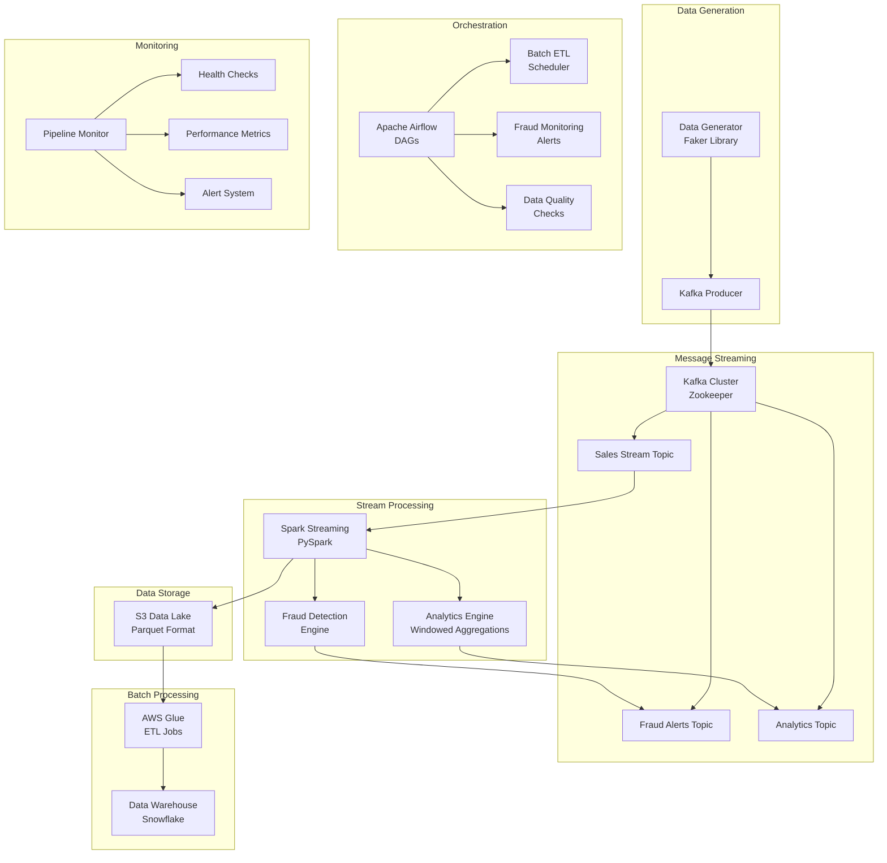

# Streamify-Analytics-Pipeline

An end-to-end data pipeline simulating real-time e-commerce transactions for live analytics and fraud detection, built with Kafka, Spark, Airflow, and AWS.

## 🏗️ Architecture Overview



## 🛠️ Tech Stack

| Component | Technology | Purpose |
|-----------|------------|---------|
| **Cloud Provider** | AWS | EC2 for compute, S3 for data lake |
| **Containerization** | Docker | Service orchestration |
| **Messaging** | Apache Kafka | Real-time data streaming |
| **Stream Processing** | Apache Spark (PySpark) | Real-time analytics & fraud detection |
| **Orchestration** | Apache Airflow | Workflow management |
| **Data Lake** | AWS S3 | Raw data storage (Parquet) |
| **Data Warehouse** | Snowflake | Structured analytics data |
| **ETL Processing** | AWS Glue | Batch data transformation |
| **Language** | Python 3.x | Core development language |

## 📅 Project Timeline

| Week | Phase | Components | Deliverables |
|------|-------|------------|--------------|
| **1-2** | Foundation & Ingestion | Data Generator, Kafka Setup | Producer script, Kafka topics |
| **3-5** | Stream Processing | Spark Streaming, Fraud Detection | Real-time processing pipeline |
| **6-8** | Data Lake & Warehousing | S3 Integration, Snowflake | Data storage & warehouse |
| **9-11** | Batch Orchestration | Airflow DAGs, Glue Jobs | Automated workflows |
| **12** | Documentation | Testing, Monitoring | Complete documentation |

## 🚀 Quick Start

### Prerequisites

- Python 3.8+
- Docker & Docker Compose
- AWS Account with appropriate permissions
- Snowflake account (free trial available)

### 1. Clone and Setup

```bash
git clone https://github.com/your-username/streamify-analytics-pipeline.git
cd streamify-analytics-pipeline
pip install -r requirements.txt
```

### 2. Environment Configuration

```bash
cp env.example .env
# Edit .env with your AWS and Snowflake credentials
```

### 3. Start Infrastructure

```bash
# Start Kafka and Zookeeper
docker-compose up -d

# Setup Kafka topics
python scripts/setup_kafka_topics.py
```

### 4. Run the Pipeline

```bash
# Start data generation
python src/producer/producer.py

# Start stream processing (in another terminal)
python src/processor/stream_processor.py

# Start Airflow (in another terminal)
docker-compose up airflow-webserver airflow-scheduler
```

### 5. Access Services

- **Airflow UI**: http://localhost:8080 (admin/admin)
- **Kafka Topics**: Use Kafka tools or monitoring scripts
- **Snowflake**: Access via your Snowflake console

## 📊 Components Deep Dive

### Data Generator (`src/producer/producer.py`)

Simulates realistic e-commerce transactions with:
- **User Behavior Patterns**: Normal, high-value, suspicious users
- **Product Categories**: Electronics, clothing, books, etc.
- **Payment Methods**: Credit card, PayPal, Apple Pay, etc.
- **Geographic Data**: Realistic location information
- **Fraud Simulation**: Configurable suspicious patterns

**Key Features:**
- Configurable batch sizes and intervals
- Realistic transaction amounts and patterns
- Multiple user behavior profiles
- Geographic and device diversity

### Stream Processing (`src/processor/`)

#### Fraud Detection Engine
- **Rule-based Detection**: High amounts, rapid transactions
- **ML-based Scoring**: User behavior analysis
- **Geographic Anomalies**: Impossible travel detection
- **Device Analysis**: Unusual device patterns
- **Real-time Alerts**: Kafka topic for fraud notifications

#### Analytics Engine
- **Windowed Aggregations**: 1-minute sliding windows
- **KPI Calculations**: Revenue, conversion rates, AOV
- **Product Performance**: Top categories and products
- **User Analytics**: Customer behavior patterns
- **Geographic Analysis**: Sales by location

### Data Storage

#### S3 Data Lake
- **Raw Data**: Parquet format with partitioning
- **Processed Data**: Cleaned and transformed data
- **Analytics Results**: Aggregated metrics
- **Lifecycle Policies**: Automatic archival and cleanup

#### Snowflake Data Warehouse
- **Raw Transactions**: Complete transaction history
- **Fraud Alerts**: All fraud detection results
- **Analytics Results**: Windowed aggregations
- **KPI Metrics**: Business intelligence data

### Orchestration (Airflow DAGs)

#### Main Pipeline DAG (`dags/streamify_analytics_pipeline.py`)
- **Hourly Schedule**: Automated data processing
- **Health Checks**: Infrastructure monitoring
- **Data Quality**: Validation and cleaning
- **ETL Processing**: S3 to Snowflake loading
- **Report Generation**: Analytics summaries

#### Fraud Monitoring DAG (`dags/fraud_detection_monitoring.py`)
- **15-minute Schedule**: Real-time fraud monitoring
- **Pattern Analysis**: Fraud trend detection
- **Performance Monitoring**: System health checks
- **Alert Generation**: Critical fraud notifications

## 🔧 Configuration

### Environment Variables

```bash
# AWS Configuration
AWS_ACCESS_KEY_ID=your_access_key
AWS_SECRET_ACCESS_KEY=your_secret_key
AWS_DEFAULT_REGION=us-east-1
S3_BUCKET_NAME=streamify-analytics-data-lake

# Kafka Configuration
KAFKA_BOOTSTRAP_SERVERS=localhost:9092
KAFKA_TOPIC_SALES=sales_stream
KAFKA_TOPIC_FRAUD=fraud_alerts

# Snowflake Configuration
SNOWFLAKE_ACCOUNT=your_account.snowflakecomputing.com
SNOWFLAKE_USER=your_username
SNOWFLAKE_PASSWORD=your_password
SNOWFLAKE_WAREHOUSE=COMPUTE_WH
SNOWFLAKE_DATABASE=STREAMIFY_ANALYTICS
SNOWFLAKE_SCHEMA=PUBLIC
```

### Fraud Detection Thresholds

```python
FRAUD_THRESHOLDS = {
    'high_amount': 2000.0,           # Flag transactions > $2000
    'rapid_transactions': 3,         # Flag 3+ transactions in 5 seconds
    'velocity_threshold': 1000.0,    # $1000 per minute spending
    'geographic_anomaly': 0.8,       # 80% confidence for geo anomalies
    'device_anomaly': 0.7            # 70% confidence for device anomalies
}
```

## 📈 Monitoring and Alerting

### Pipeline Monitoring (`scripts/monitor_pipeline.py`)

Real-time monitoring of:
- **Kafka Health**: Cluster status, topic lag, throughput
- **S3 Storage**: Usage, recent data, capacity
- **Snowflake Performance**: Query times, data freshness
- **System Resources**: CPU, memory, disk usage
- **Pipeline Throughput**: Transactions per hour, fraud rates

### Alert Levels

- **CRITICAL**: System failures, data loss, security breaches
- **WARNING**: Performance degradation, capacity issues
- **INFO**: Normal operations, status updates

### Testing Suite (`scripts/pipeline_test.py`)

Comprehensive testing including:
- **Component Tests**: Individual service health checks
- **Integration Tests**: End-to-end pipeline validation
- **Performance Tests**: Throughput and latency benchmarks
- **Data Quality Tests**: Validation and consistency checks

## 📊 Analytics and Reporting

### Real-time Dashboards

Access live analytics through:
- **Airflow UI**: Pipeline status and logs
- **Snowflake Console**: Data warehouse queries
- **Custom Dashboards**: Grafana or similar tools

### Key Metrics

- **Business Metrics**: Revenue, transactions, conversion rates
- **Fraud Metrics**: Detection rates, false positives, alert volumes
- **Technical Metrics**: Processing latency, throughput, error rates
- **Data Quality**: Completeness, accuracy, freshness

### Sample Queries

```sql
-- Daily sales summary
SELECT * FROM daily_sales_summary 
ORDER BY sale_date DESC LIMIT 7;

-- Fraud analysis
SELECT * FROM fraud_analysis 
WHERE alert_date >= CURRENT_DATE() - 7;

-- Product performance
SELECT * FROM product_performance 
ORDER BY total_revenue DESC LIMIT 10;
```

## 🚨 Troubleshooting

### Common Issues

1. **Kafka Connection Failed**
   ```bash
   # Check if Kafka is running
   docker-compose ps
   # Restart if needed
   docker-compose restart kafka
   ```

2. **Snowflake Connection Error**
   ```bash
   # Verify credentials in .env file
   # Check network connectivity
   python -c "import snowflake.connector; print('Connection OK')"
   ```

3. **S3 Access Denied**
   ```bash
   # Verify AWS credentials
   aws s3 ls s3://your-bucket-name
   ```

4. **Airflow DAG Not Running**
   ```bash
   # Check Airflow logs
   docker-compose logs airflow-scheduler
   # Restart Airflow services
   docker-compose restart airflow-scheduler
   ```

### Performance Optimization

1. **Kafka Tuning**
   - Increase partition count for higher throughput
   - Adjust batch size and linger time
   - Monitor consumer lag

2. **Spark Optimization**
   - Tune executor memory and cores
   - Optimize windowing operations
   - Use appropriate checkpointing

3. **S3 Optimization**
   - Use Parquet compression
   - Implement partitioning strategies
   - Set up lifecycle policies

## 🔒 Security Considerations

- **Data Encryption**: All data encrypted in transit and at rest
- **Access Control**: IAM roles and policies for AWS services
- **Network Security**: VPC configuration and security groups
- **Audit Logging**: Comprehensive logging for compliance
- **Data Privacy**: PII handling and anonymization

## 📚 Additional Resources

- [Apache Kafka Documentation](https://kafka.apache.org/documentation/)
- [Apache Spark Documentation](https://spark.apache.org/docs/)
- [Apache Airflow Documentation](https://airflow.apache.org/docs/)
- [AWS Glue Documentation](https://docs.aws.amazon.com/glue/)
- [Snowflake Documentation](https://docs.snowflake.com/)

## 🤝 Contributing

1. Fork the repository
2. Create a feature branch
3. Make your changes
4. Add tests
5. Submit a pull request

## 📄 License

This project is licensed under the MIT License - see the [LICENSE](LICENSE) file for details.

## 📞 Support

For questions and support:
- Create an issue in the GitHub repository
- Contact the development team
- Check the troubleshooting section

---

**Built with ❤️ for real-time analytics and fraud detection**
